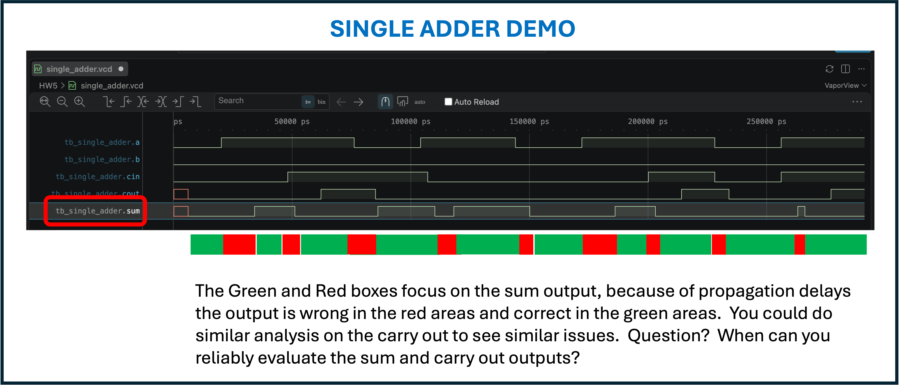
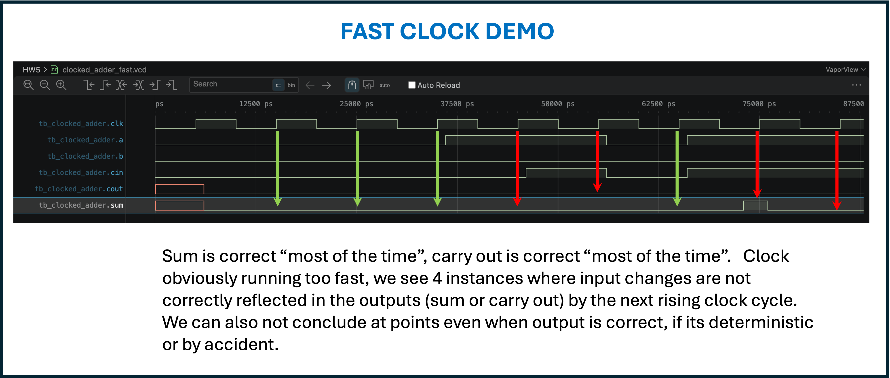
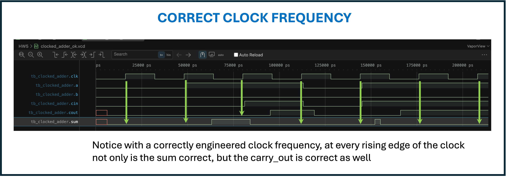

# HW5 Output

Check out the runs and the output figures.

### 1. Setup - Build the Verlog Hardware Description Programs
```bash
bsm23@RISCV:~/SysArch-DGL/HW-DEMOS/HW5$ make
iverilog -o sim_single.vvp -Ptb_single_adder.GATE_DELAY_RISE=7 -Ptb_single_adder.GATE_DELAY_FALL=3 full_adder.v tb_single_adder.v
iverilog -o sim_clk_fast.vvp -Ptb_clocked_adder.GATE_DELAY_RISE=7 -Ptb_clocked_adder.GATE_DELAY_FALL=3 -Ptb_clocked_adder.CLK_PERIOD=10 -Ptb_clocked_adder.DUMPFILE=\"clocked_adder_fast.vcd\" full_adder.v tb_clocked_adder.v
iverilog -o sim_clk_ok.vvp -Ptb_clocked_adder.GATE_DELAY_RISE=7 -Ptb_clocked_adder.GATE_DELAY_FALL=3 -Ptb_clocked_adder.CLK_PERIOD=32 -Ptb_clocked_adder.DUMPFILE=\"clocked_adder_ok.vcd\" full_adder.v tb_clocked_adder.v
```

### 2. Run Unclocked

```bash
bsm23@RISCV:~/SysArch-DGL/HW-DEMOS/HW5$ make run_single
vvp sim_single.vvp
VCD info: dumpfile single_adder.vcd opened for output.
    [trace] t=6 ns: sum  changed to 0
    [trace] t=6 ns: cout changed to 0
=========================================================
Round 1 (t=20 ns): a 0 -> 1, cin stays 0
  NAIVE read at +1 ns : sum=0 cout=0  <-- mid-settle
  NAIVE read at +5 ns : sum=0 cout=0  <-- mid-settle
  NAIVE read at +9 ns : sum=0 cout=0  <-- mid-settle
    [trace] t=34 ns: sum  changed to 1
  COORD read at +28 ns: sum=1 cout=0  <-- correct, waited the safe delay
=========================================================
Round 2 (t=48 ns): cin 0 -> 1, a stays 1
  NAIVE read at +1 ns : sum=1 cout=0  <-- mid-settle
    [trace] t=51 ns: sum  changed to 0
  NAIVE read at +5 ns : sum=0 cout=0  <-- mid-settle
  NAIVE read at +9 ns : sum=0 cout=0  <-- mid-settle
    [trace] t=62 ns: cout changed to 1
  COORD read at +28 ns: sum=0 cout=1  <-- correct, waited the safe delay
=========================================================
Round 3 (t=76 ns): a 1 -> 0, cin stays 1
  NAIVE read at +1 ns : sum=0 cout=1  <-- mid-settle
  NAIVE read at +5 ns : sum=0 cout=1  <-- mid-settle
  NAIVE read at +9 ns : sum=0 cout=1  <-- mid-settle
    [trace] t=85 ns: cout changed to 0
    [trace] t=86 ns: sum  changed to 1
  COORD read at +28 ns: sum=1 cout=0  <-- correct, waited the safe delay
=========================================================
Round 4, CHAOS (t=104 ns): a 0 -> 1, then cin 1 -> 0
only 3 ns later, before Round 4's own first change has
finished settling. Two transitions overlapping, no clock,
no coordination, this is the round with no safe moment to
look until you deliberately wait for one.
  NAIVE read: sum=1 cout=0  <-- two changes mid-flight at once
    [trace] t=110 ns: sum  changed to 0
  NAIVE read: sum=0 cout=0  <-- still not trustworthy
  NAIVE read: sum=0 cout=0  <-- still not trustworthy
    [trace] t=118 ns: sum  changed to 1
  COORD read, waited 28 ns after the LAST change: sum=1 cout=0  <-- correct, because it waited for the real last change, not the first one
=========================================================
Round 5: does it matter how MANY bits change at once?
=========================================================
    [trace] t=150 ns: sum  changed to 0
    [trace] t=186 ns: sum  changed to 1
---------------------------------------------------------
Round 5a (t=200 ns): ONE bit flips, cin 0 -> 1 (a already sitting at 1)
    [trace] t=203 ns: sum  changed to 0
    [trace] t=214 ns: cout changed to 1
  settled by t=+28 ns: sum=0 cout=1
    [trace] t=234 ns: cout changed to 0
---------------------------------------------------------
Round 5b (t=256 ns): TWO bits flip at once, a 0->1 AND cin 0->1 together
    [trace] t=263 ns: sum  changed to 1
    [trace] t=266 ns: sum  changed to 0
    [trace] t=277 ns: cout changed to 1
  settled by t=+28 ns: sum=0 cout=1
---------------------------------------------------------
Compare the 'changed to' timestamps printed above against
r5a_start=200 ns and r5b_start=256 ns: 5b's sum and cout each
settle one gate-stage later than 5a's, because flipping a
forces axorb to be recomputed before the cin-dependent
path can even start. Two bits changing isn't just 'twice
as much change happening', it's a longer dependency chain
to wait out, and that shows up directly as more time.
=========================================================
Final settled state: a=1 b=0 cin=1 -> sum=0 cout=1
=========================================================
tb_single_adder.v:174: $finish called at 284000 (1ps)
```


### 3. Run With Clock Too Fast

```bash
bsm23@RISCV:~/SysArch-DGL/HW-DEMOS/HW5$ make run_clk_fast
vvp sim_clk_fast.vvp
VCD info: dumpfile clocked_adder_fast.vcd opened for output.
=========================================================
CLK_PERIOD=10 ns, worst-case settle from an edge is up to
22 ns (1 ns register delay + 21 ns worst combinational
path). Watch for MISMATCH lines below if CLK_PERIOD is
shorter than that.
=========================================================
t=5 ns: CLK RISE - sampled sum=x cout=x | ground truth sum=0 cout=0 -> MISMATCH -- clock looked mid-flight!
    [trace] t=6 ns: sum  changed to 0
    [trace] t=6 ns: cout changed to 0
t=15 ns: CLK RISE - sampled sum=0 cout=0 | ground truth sum=0 cout=0 ->                                MATCH
t=25 ns: CLK RISE - sampled sum=0 cout=0 | ground truth sum=0 cout=0 ->                                MATCH
t=35 ns: CLK RISE - sampled sum=0 cout=0 | ground truth sum=0 cout=0 ->                                MATCH
---------------------------------------------------------
t=36 ns: new vector applied: a=1 cin=0 (one bit changed)
t=45 ns: CLK RISE - sampled sum=0 cout=0 | ground truth sum=0 cout=0 ->                                MATCH
---------------------------------------------------------
t=46 ns: new vector applied: a=1 cin=1 (one bit changed)
t=55 ns: CLK RISE - sampled sum=0 cout=0 | ground truth sum=0 cout=0 ->                                MATCH
---------------------------------------------------------
t=56 ns: new vector applied: a=0 cin=0 (two bits changed)
t=65 ns: CLK RISE - sampled sum=0 cout=0 | ground truth sum=0 cout=0 ->                                MATCH
---------------------------------------------------------
t=66 ns: new vector applied: a=1 cin=1 (two bits changed, worst case)
    [trace] t=73 ns: sum  changed to 1
t=75 ns: CLK RISE - sampled sum=1 cout=0 | ground truth sum=0 cout=0 -> MISMATCH -- clock looked mid-flight!
    [trace] t=76 ns: sum  changed to 0
t=85 ns: CLK RISE - sampled sum=0 cout=0 | ground truth sum=0 cout=0 ->                                MATCH
=========================================================
Done. Count the MISMATCH lines above: CLK_PERIOD_FAST should
show real ones, CLK_PERIOD_OK should show none.
=========================================================
tb_clocked_adder.v:186: $finish called at 85000 (1ps)
```


### 4. Run With Good Clock Frequency

```bash
bsm23@RISCV:~/SysArch-DGL/HW-DEMOS/HW5$ make run_clk_ok
vvp sim_clk_ok.vvp
VCD info: dumpfile clocked_adder_ok.vcd opened for output.
=========================================================
CLK_PERIOD=32 ns, worst-case settle from an edge is up to
22 ns (1 ns register delay + 21 ns worst combinational
path). Watch for MISMATCH lines below if CLK_PERIOD is
shorter than that.
=========================================================
    [trace] t=6 ns: sum  changed to 0
    [trace] t=6 ns: cout changed to 0
t=16 ns: CLK RISE - sampled sum=0 cout=0 | ground truth sum=0 cout=0 ->                                MATCH
t=48 ns: CLK RISE - sampled sum=0 cout=0 | ground truth sum=0 cout=0 ->                                MATCH
---------------------------------------------------------
t=49 ns: new vector applied: a=1 cin=0 (one bit changed)
    [trace] t=63 ns: sum  changed to 1
t=80 ns: CLK RISE - sampled sum=1 cout=0 | ground truth sum=1 cout=0 ->                                MATCH
---------------------------------------------------------
t=81 ns: new vector applied: a=1 cin=1 (one bit changed)
    [trace] t=84 ns: sum  changed to 0
    [trace] t=95 ns: cout changed to 1
t=112 ns: CLK RISE - sampled sum=0 cout=1 | ground truth sum=0 cout=1 ->                                MATCH
---------------------------------------------------------
t=113 ns: new vector applied: a=0 cin=0 (two bits changed)
    [trace] t=119 ns: cout changed to 0
t=144 ns: CLK RISE - sampled sum=0 cout=0 | ground truth sum=0 cout=0 ->                                MATCH
---------------------------------------------------------
t=145 ns: new vector applied: a=1 cin=1 (two bits changed, worst case)
    [trace] t=152 ns: sum  changed to 1
    [trace] t=155 ns: sum  changed to 0
    [trace] t=166 ns: cout changed to 1
t=176 ns: CLK RISE - sampled sum=0 cout=1 | ground truth sum=0 cout=1 ->                                MATCH
t=208 ns: CLK RISE - sampled sum=0 cout=1 | ground truth sum=0 cout=1 ->                                MATCH
=========================================================
Done. Count the MISMATCH lines above: CLK_PERIOD_FAST should
show real ones, CLK_PERIOD_OK should show none.
=========================================================
tb_clocked_adder.v:186: $finish called at 208000 (1ps)
```



### 5. Cleanup

```bash
bsm23@RISCV:~/SysArch-DGL/HW-DEMOS/HW5$ make clean
rm -f sim_single.vvp sim_clk_fast.vvp sim_clk_ok.vvp single_adder.vcd clocked_adder_fast.vcd clocked_adder_ok.vcd
```