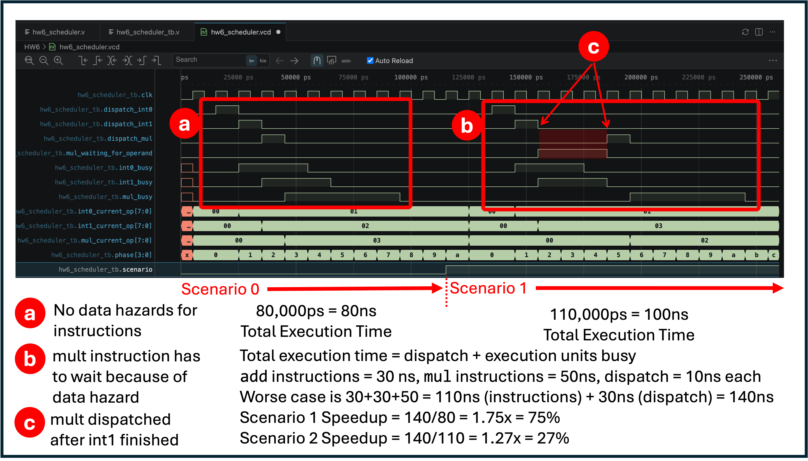

# HW6 Output

This demo shows how modern CPUs use multiple ALUs to schedule work.

### 1. Setup - Build the Verlog Hardware Description Programs
```bash
bsm23@RISCV:~/SysArch-DGL/HW-DEMOS/HW6$ make
iverilog -o hw6_scheduler.vvp hw6_scheduler.v hw6_scheduler_tb.v
bsm23@RISCV:~/SysArch-DGL/HW-DEMOS/HW6$ make run
vvp hw6_scheduler.vvp
VCD info: dumpfile hw6_scheduler.vcd opened for output.

==========================================
SCENARIO 0: INDEPENDENT
==========================================

==========================================
SCENARIO 1: DATA DEPENDENCY
==========================================

Simulation complete.
Open hw6_scheduler.vcd in VaporView.

hw6_scheduler_tb.v:195: $finish called at 255000 (1ps)
bsm23@RISCV:~/SysArch-DGL/HW-DEMOS/HW6$ make clean
rm -f hw6_scheduler.vvp hw6_scheduler.vcd
```

### 2. Check out the results



Note that having multiple execution units allows multiple independant instructions to execute in parallel.  This is a widely used technique by modern processors, and drive aggressive support for out-of-order execution.  

Modern CPUs tend to have between 9 and 12 executuion units per core. 